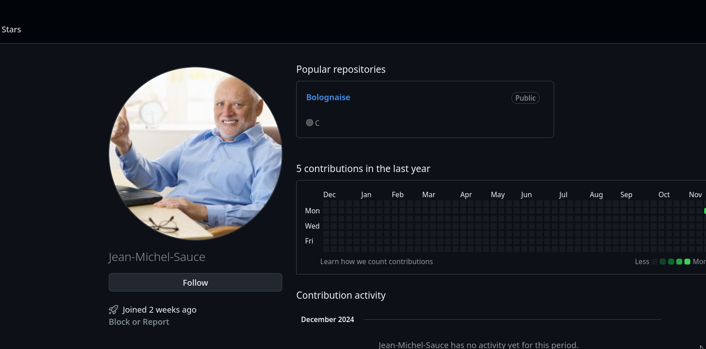
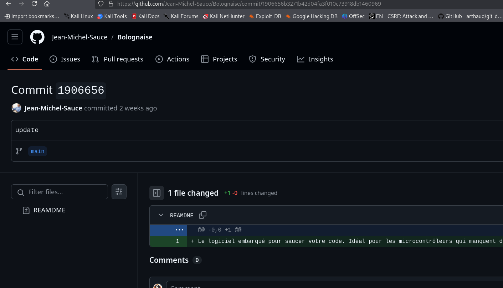
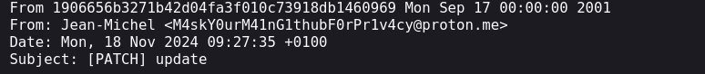

# Finding the GitHub Profile

**Provided Information**:
- Developer
- Username: `Jean-Michel-Sauce`

## Identifying the GitHub Account

Using a simple search on GitHub, we located the following account:

**Profile URL**:  
https://github.com/Jean-Michel-Sauce

## Extracting the Email Address

### Step 1: Exploring Repositories

To search for an email, we examined the commit messages within one of the developer’s repositories:  
https://github.com/Jean-Michel-Sauce/Bolognaise

### Step 2: Viewing Commit Details

We selected a specific commit from the repository:  

https://github.com/Jean-Michel-Sauce/Bolognaise/commit/1906656b3271b42d04fa3f010c73918db1460969

### Step 3: Revealing the Full Commit Message

By appending `.patch` to the commit URL, we accessed the full commit message:  
https://github.com/Jean-Michel-Sauce/Bolognaise/commit/1906656b3271b42d04fa3f010c73918db1460969.patch

### Step 4: Extracted Email Address

Within the `.patch` file, the following email was revealed:

**Email**:  
`M4skY0urM41nG1thubF0rPr1v4cy@proton.me`
