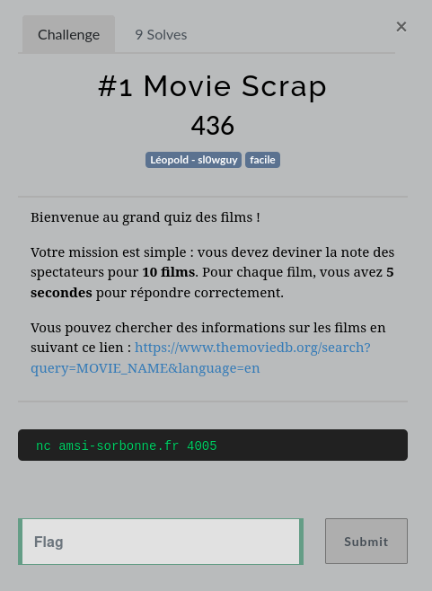
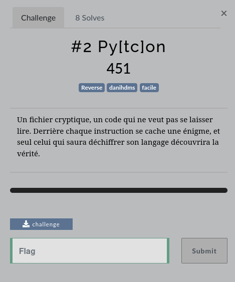
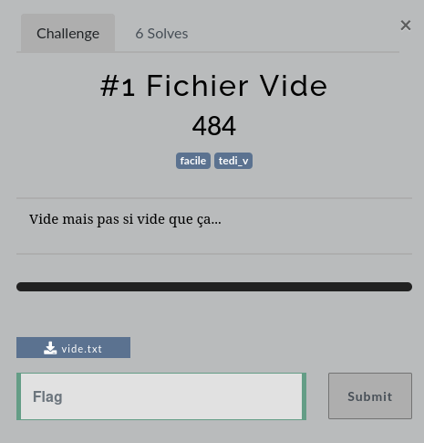

# AMSI2024 Challenge Writeups

This repository contains my solutions and writeups for the AMSI2024 challenges I completed. Below is a summary of the challenges, grouped by category, with links to their respective writeups.

## Challenges

### Network
- **WifiHunt**  
  [Writeup](Network/WifiHunt/README.md) | 

### OSINT
- **Apero**  
  [Writeup](OSINT/Apero/README.md) | 

- **BiMoteur**  
  [Writeup](OSINT/BiMoteur/README.md) |  |  | 

### Prog
- **Movie**  
  [Writeup](Prog/Movie/README.md) | 

### Reverse
- **Py[ct]on**  
  [Writeup](Reverse/Py[ct]on/README.md) |  | [Challenge Script](Reverse/Py[ct]on/challenge.py) | [Compiled Script](Reverse/Py[ct]on/challenge.pyc)

### Steganography
- **FichierVide**  
  [Writeup](Steganography/FichierVide/README.md) |  | [ReverseFuck](Steganography/FichierVide/reversefuck.txt) | [File](Steganography/FichierVide/vide.txt)

---

Each directory contains the necessary files and resources used to solve the respective challenge.
